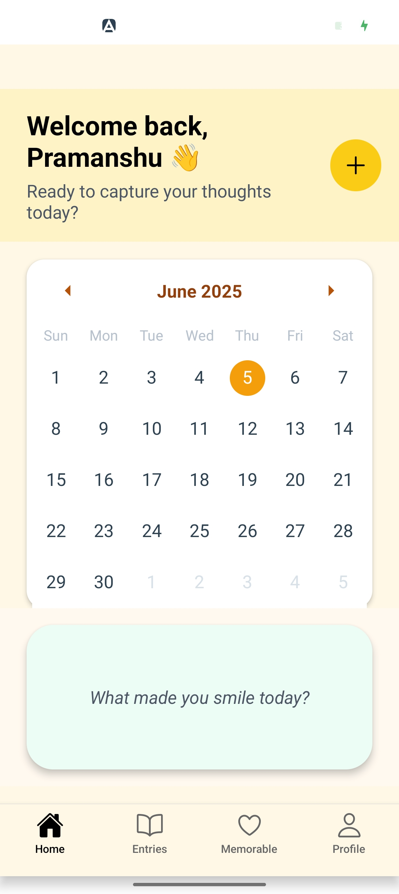
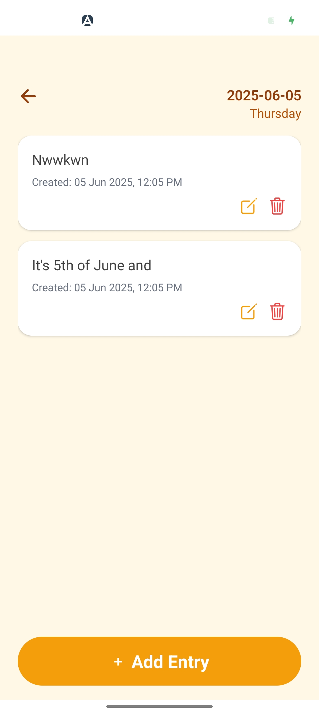
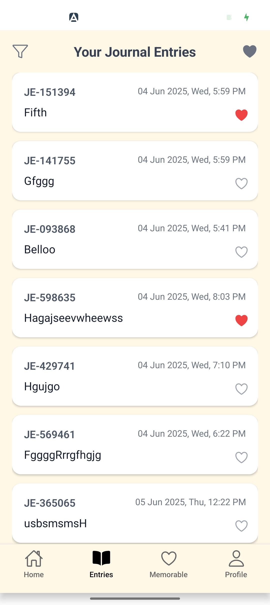
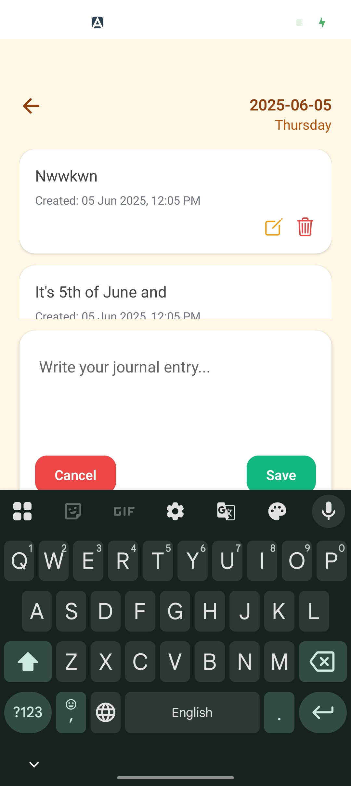
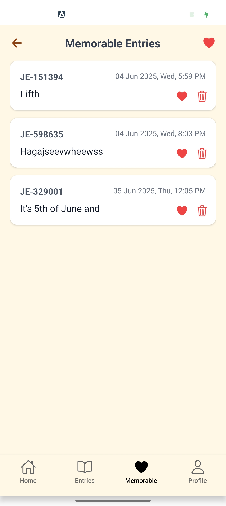

# 📝 JournalingApp

A clean and thoughtful journaling app built with React Native and Expo. Users can write, view, and filter daily journal entries, mark memorable ones, and view them on a dedicated screen.

## 📷 Demo Screenshots







---

## ⚙️ Technologies Used

- [React Native](https://reactnative.dev/)
- [Expo SDK](https://docs.expo.dev/)
- [expo-router](https://expo.github.io/router/docs)
- [NativeWind (Tailwind CSS for React Native)](https://www.nativewind.dev/)
- [@react-native-async-storage/async-storage](https://react-native-async-storage.github.io/async-storage/)
- [react-native-calendars](https://github.com/wix/react-native-calendars)
- [date-fns](https://date-fns.org/)

---

## 🎨 Brief Design Rationale

The app focuses on simplicity and clarity, using soft colors and a minimalistic layout to encourage reflective writing.
The tab-based navigation ensures a user-friendly experience, while entry sorting, filtering, and tagging features enhance usability.

---

## 🚀 Getting Started

### Prerequisites

Make sure you have:

- **Node.js** installed
- **Expo CLI** installed (`npm install -g expo-cli`)
- **Expo Go** app on your mobile device (for preview)

All dependencies (`expo-router`, `nativewind`, `async-storage`, `react-native-calendars`, etc.) are listed in the `package.json`.

---

### How to Run the App Locally

1. **Clone the repository:**

   ```bash
   git clone https://github.com/P01Sensai/JournalingApp.git
   cd JournalingApp


